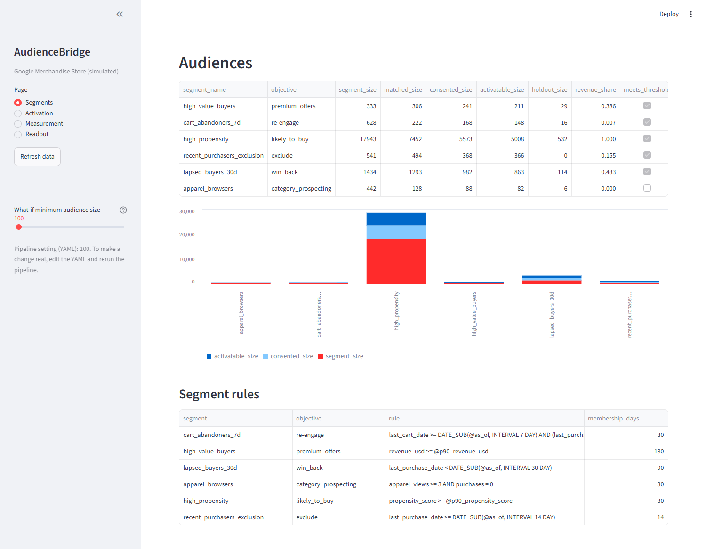
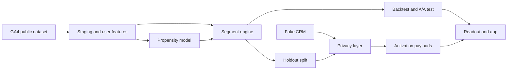
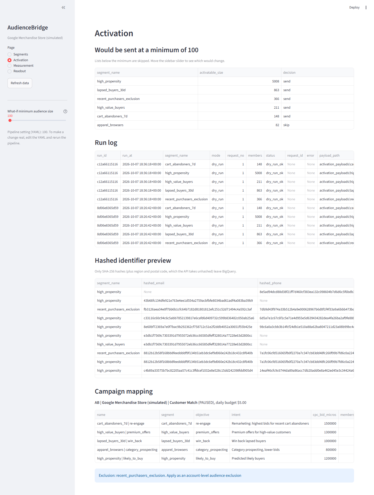
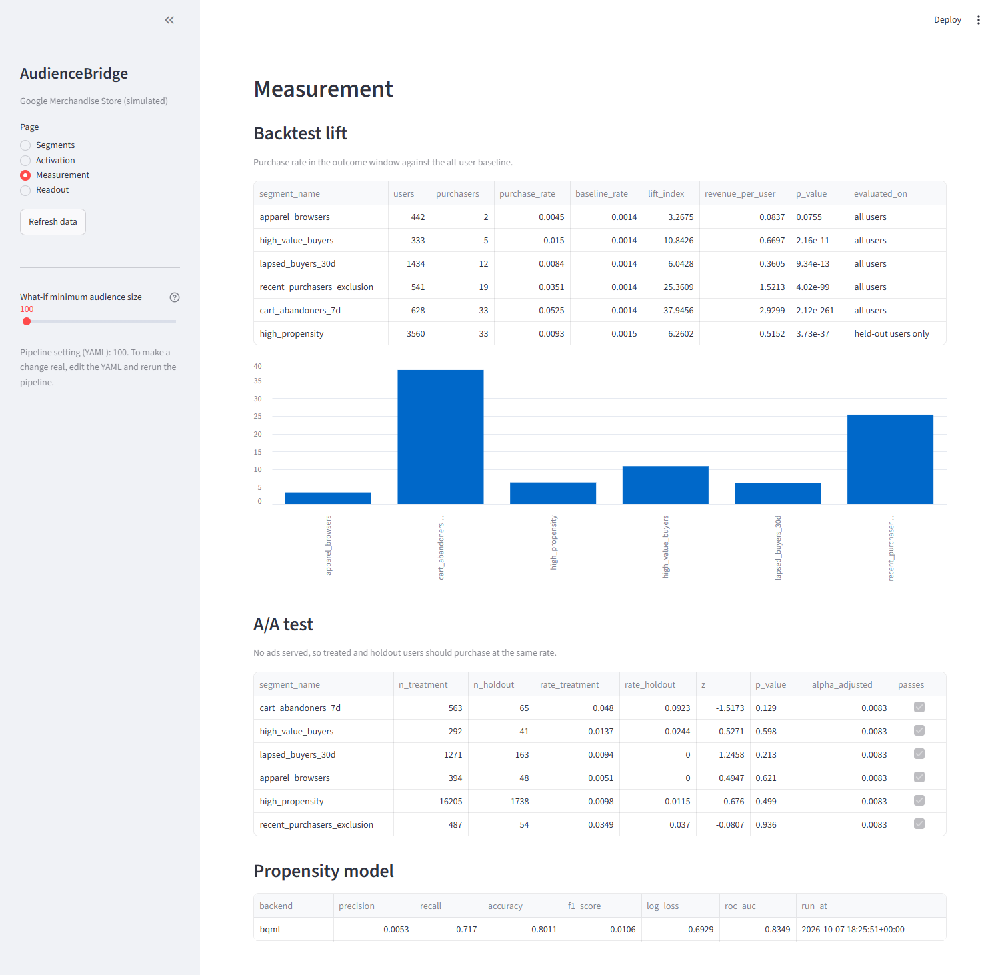
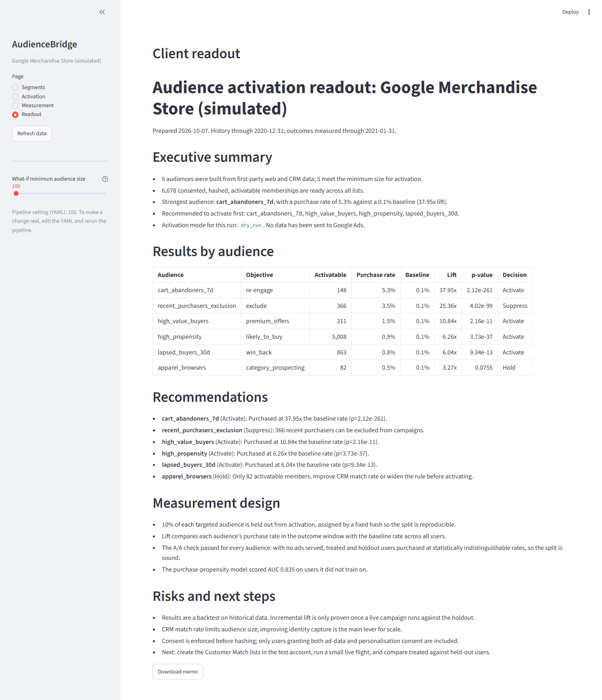

# AudienceBridge

A pipeline that turns website analytics and a customer list into ad audiences for Google Ads, and checks which audiences are actually worth targeting.

## What it does

AudienceBridge takes a retailer's website events and customer records, sorts visitors into groups based on what they did (cart abandoners, high value buyers, lapsed buyers and so on), and tests those groups against what really happened next. Customer details are hashed so they can be prepared for Google Ads Customer Match without sharing real emails or phone numbers. A small Streamlit app shows the results.

The example client is the Google Merchandise Store. The website events (4.3M events, 270K users) come from Google's public GA4 sample dataset in BigQuery. The customer list is made up with Faker, so no real personal data is used.

## What it solves

A retailer usually runs one broad ad campaign for everyone, even though it already knows who abandoned a cart, who spends the most and who just bought. This project handles that gap:

- finds the groups worth targeting, such as cart abandoners, who bought at about 38 times the baseline rate in the following month
- keeps customer data private by only using people who gave consent and by hashing their details with SHA-256
- stops ads going to people who just bought
- checks the results before any money is spent, using a holdout group, a backtest and an A/A test

## Architecture

The work is done by SQL in BigQuery, driven by a Python package. Audiences are written as rules in a YAML file, so a new audience is a config change and not a code change. Nothing is sent to Google Ads. Uploads are built and checked as payload files (a dry run).

## Tech stack

| Area | Tools |
|---|---|
| Data warehouse | Google BigQuery |
| Source data | GA4 public sample dataset |
| Modelling | BigQuery ML (scikit-learn as a fallback) |
| Pipeline | Python, SQL, pandas, PyYAML |
| Fake data | Faker |
| Activation | Google Ads API and Data Manager API (payloads and campaign plan only) |
| App | Streamlit |
| Testing | pytest, ruff |

## Screenshots

**Activation.** Which lists would be sent, and the hashed identifiers and campaign plan behind them.

**Measurement.** Backtest lift, the A/A test and the propensity model scores.

**Readout.** A short report written from the results.

