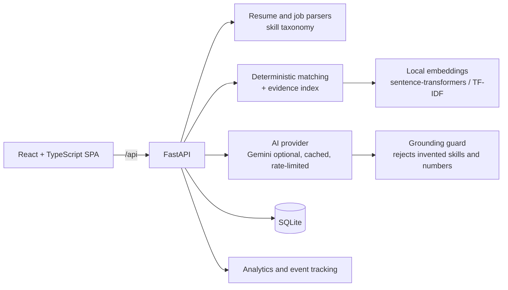

# CoopCompass

**AI-assisted co-op discovery, application preparation, and job-search intelligence for students.**


## What it is
CoopCompass helps a student decide which openings deserve their time, understand why, and prepare and track applications in one place. It replaces the usual mix of job boards, spreadsheets, resume files and chat tools with a single workflow:

```
Profile → Discover → Rank → Analyze → Tailor → Apply → Track → Learn
```

It never submits applications. The student reviews and approves everything and applies on the employer's site.

## What it does
- **Profile:** structured preferences (roles, skills, locations, work authorization, employment type, industries, salary) plus resume upload (PDF/DOCX/TXT). Extracted skills, experience, education and evidence bullets are shown as a draft to review and edit before anything is saved.
- **Job ingestion:** paste a job description, import a CSV, or fetch a single public URL (respects robots.txt, falls back to paste). Postings are normalized into structured fields (skills, experience, education, salary, deadline, responsibilities, work-authorization notes).
- **Explainable ranking:** every job gets a match score built from adjustable, deterministic factors, with the exact resume evidence behind each claim.
- **Resume gap analysis:** requirements are split into evidence already present, present but weak, and genuine gaps ("No evidence found in current resume."), plus responsibility coverage.
- **Tailoring and drafts:** resume-bullet suggestions, cover letters, short answers, recruiter and networking messages, generated only from the student's own profile, always labeled for review.
- **Tracker:** Kanban pipeline (Discovered → Saved → Preparing → Applied → Assessment → Interview → Offer / Rejected / Withdrawn) with notes, checklist, deadlines and resume version.
- **Analytics:** application funnel, weekly activity, conversion, skill-gap frequency, role and match-band performance, and time spent, computed from the user's own data.

### How matching works
The overall score is the sum of six factor scores. Weights are adjustable and can be previewed live.

| Factor | Default weight | Computed from |
|---|---|---|
| Skills | 35 | Required skills (preferred count half): demonstrated in an experience/project bullet = full credit, only listed = partial, related family (e.g. Azure vs AWS) = small credit, no evidence = 0 |
| Experience | 20 | Profile months vs. the posting's stated minimum |
| Role alignment | 15 | Title vs. target roles and responsibilities vs. profile, via local embeddings |
| Education | 10 | Degree level vs. requirement |
| Location | 10 | Preferred locations and remote preference |
| Preferences | 10 | Employment type, preferred technologies, industries, salary, sponsorship constraints |

Example breakdown for one demo job: Skills 30.9/35, Experience 16/20, Role 15/15, Education 10/10, Location 10/10, Preferences 10/10 → 92.


### Resume gap analysis and tailoring


### Application workspace


### Tracker and analytics


### Profile


## Architecture


```
frontend/      React SPA (pages: Dashboard, Job Explorer, Job Match, Resume Lab, Workspace, Tracker, Analytics, Profile)
backend/app/   FastAPI app: routers, SQLAlchemy models, services (parsing, matching, analytics, AI orchestration)
ai/            Gemini provider, prompt templates, grounding guard
scripts/       demo seeding, report generation, data deletion, screenshot capture
tests/         backend tests
data/          synthetic demo postings and demo resume
docs/          case study, prioritization, experiment designs, design spec, API contract
```

### AI design
- **Deterministic and local:** parsing, skill extraction, match scoring, evidence mapping, gap analysis, analytics. No LLM sets a score.
- **Local embeddings:** sentence-transformers for semantic similarity, with a TF-IDF fallback when the model isn't available.
- **Gemini (optional, server-side):** resume-bullet rewrites and application drafts. Requests are cached by prompt hash, capped per day, and rewrites are checked afterwards: any rewrite that adds a technology or number not in the source bullet is discarded.
- **No key, no problem:** with `AI_PROVIDER=local` (or no key) the app still works, using local guidance and clearly labeled templates.

### Data and privacy
Everything is stored locally in SQLite. Only extracted resume text is kept (the uploaded file is discarded), `.env`, databases and uploads are git-ignored, and all data can be wiped from the Profile page or `DELETE /api/data?confirm=true`. With Gemini enabled, only the selected resume bullets and job text for that action are sent; the API key never reaches the frontend.

## Tech stack
| Layer | Technology |
|---|---|
| Frontend | React, TypeScript, Vite, Tailwind CSS, Recharts, React Router, Vitest |
| Backend | Python, FastAPI, Pydantic, SQLAlchemy |
| Database | SQLite |
| AI / NLP | Gemini API (optional), sentence-transformers, scikit-learn (TF-IDF), pypdf, python-docx, BeautifulSoup |
| Testing | pytest, Vitest + Testing Library, Playwright (screenshots) |

## Job explorer


*All screenshots are captured from the running app using the synthetic demo dataset (fictional companies and candidate).*

## More
[Product case study](docs/product-case-study.md) · [MVP prioritization](docs/mvp-prioritization.md) · [Design spec](docs/design-spec.md) · [API contract](docs/api-contract.md)

---
Author: Rudrang Gade · MIT License
