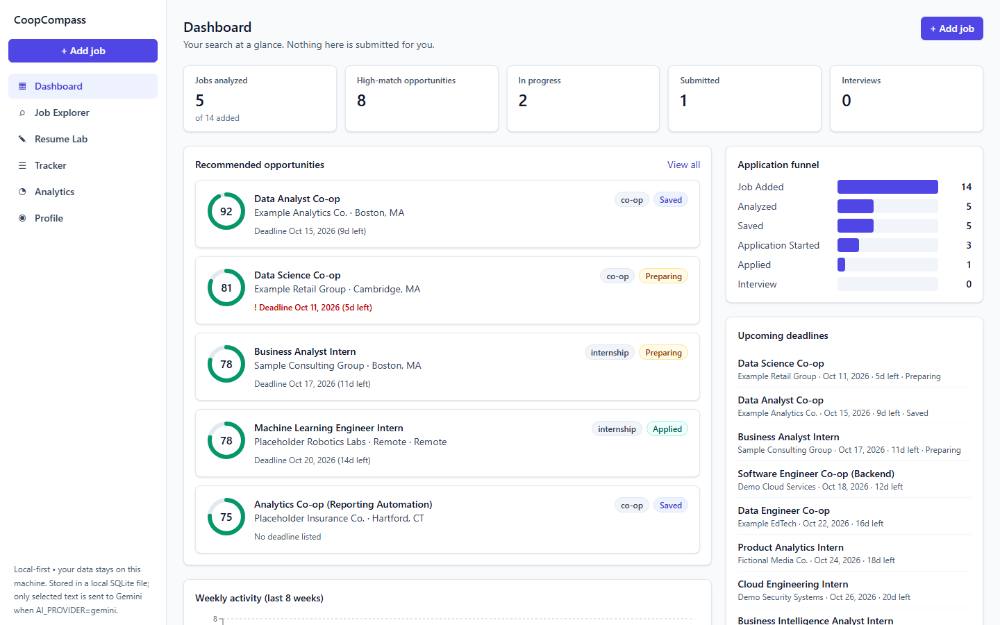
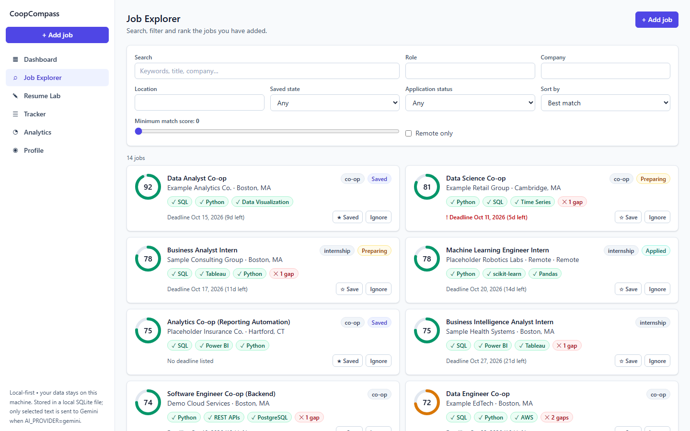
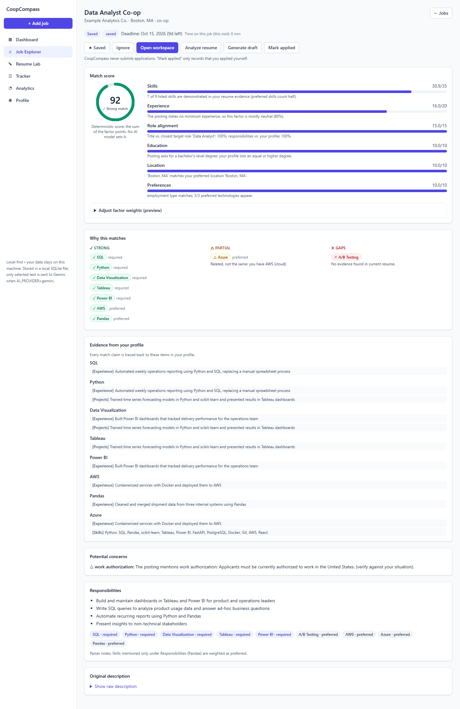
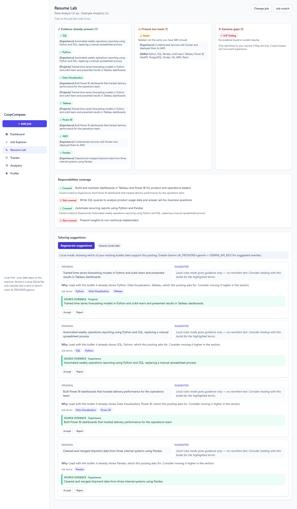
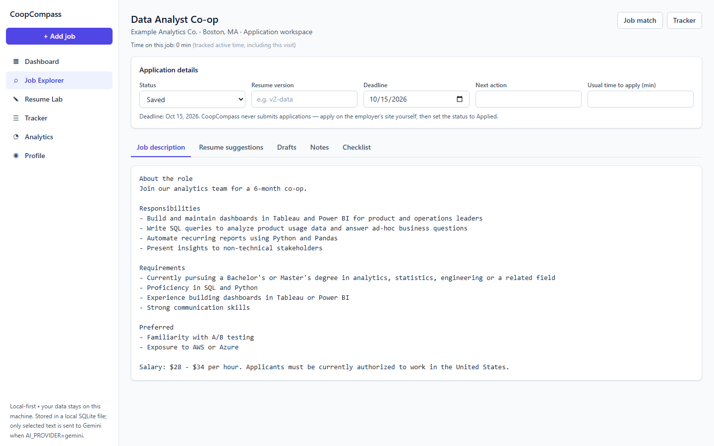
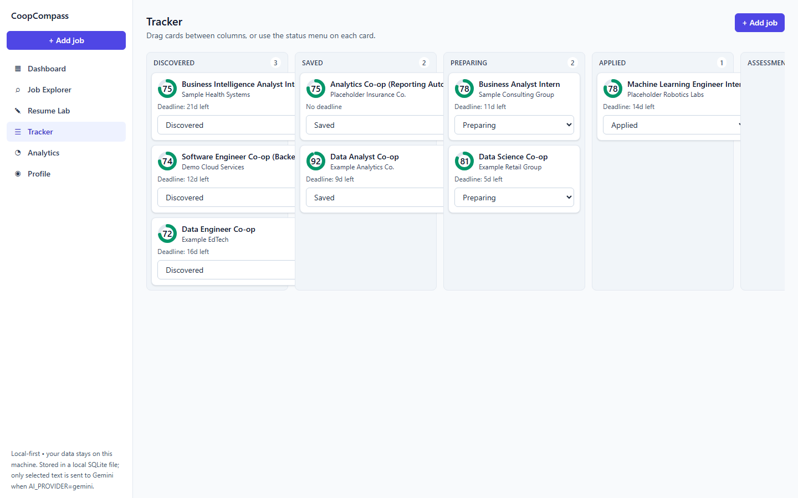
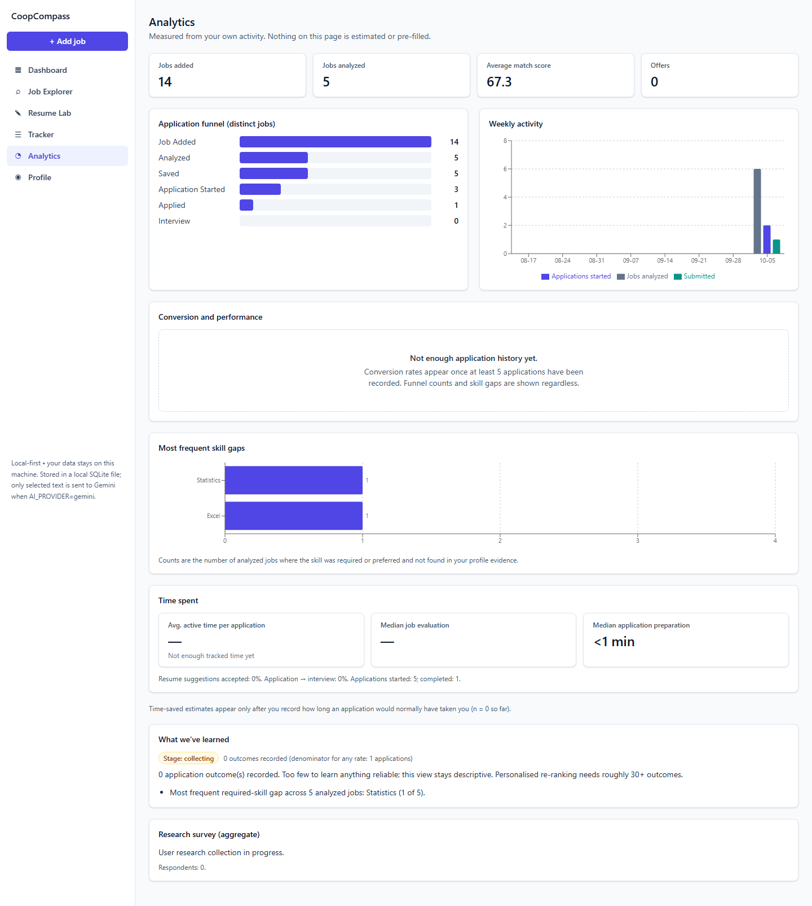
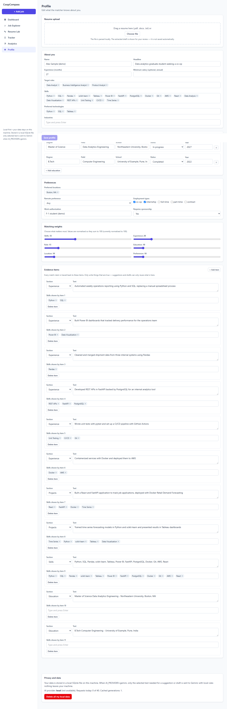

# CoopCompass UI design spec

The UI is implemented in React (TypeScript, Vite, Tailwind CSS, Recharts, react-router-dom) in `frontend/`. **No Figma designs exist yet**; this document describes the implemented UI and is the only design artefact.

## Principles
- Decision support, not automation: the app never submits applications. "Mark applied" only records what the user did.
- The match score is deterministic and explainable: always shown with the per-factor breakdown (points/weight) and evidence.
- Honesty: every number comes from the API. `null` renders as an en dash or the API's message, never as 0. Generated text always carries the API `disclaimer` verbatim.
- Restrained visual language: neutral slate, one indigo accent, no gradients, no logos, no chatbot-first UI. State is never conveyed by colour alone (icons ✓ △ ✕ plus text).

## Information architecture and navigation
Left sidebar (top bar with a Menu drawer below 768px), in workflow order:

| Route | Page | Workflow step |
|---|---|---|
| `/` | Dashboard | overview, onboarding |
| `/jobs` | Job Explorer | Discover, Rank |
| `/jobs/:id` | Job Match | Understand fit |
| `/resume-lab`, `/resume-lab/:jobId` | Resume Lab | Understand fit, Tailor |
| `/jobs/:id/workspace` | Application Workspace (not in nav; reached from Job Match, Tracker) | Tailor, Apply |
| `/tracker` | Tracker (Kanban) | Track |
| `/analytics` | Analytics | Learn |
| `/profile` | Profile | Profile |

Global: "+ Add job" button (sidebar) opens a modal with tabs Paste description / From URL / CSV import. Sidebar footer: "Local-first • your data stays on this machine" with the true detail (local SQLite; only selected text goes to Gemini when AI_PROVIDER=gemini). When `health.demo_data` is true a thin amber banner reads "Demo data — sample postings are synthetic, not real openings."

## Page hierarchy
- **Dashboard**: onboarding card (only if no profile) > 5 stat cards > Recommended opportunities (top 5 by match, ignored excluded) + Application funnel + Upcoming deadlines + Weekly activity > "Time saved" card (only when `observations_with_baseline > 0`, labelled "n = X self-reported observations; not claimable until n >= threshold").
- **Job Explorer**: filter panel (search, role, company, location, saved state, application status, sort, min-score slider, remote) > job card grid. Card: match ring, title, company/location, type chip, status badge, strength chips (✓), gap count (✕), deadline, Save/Ignore.
- **Job Match**: header + actions > Match score (ring, breakdown bars with detail text, collapsible weights editor with live preview and "Save to profile") > Why this matches (✓ Strong / △ Partial with reason / ✕ Gaps) > Evidence from your profile > Concerns > Responsibilities + skills > collapsible raw description.
- **Resume Lab**: job picker (or direct link) > three columns (Evidence present / Present but weak / Genuine gaps — gaps always say "No evidence found in current resume.") > responsibilities coverage > Tailoring suggestions.
- **Suggestion card**: ORIGINAL, SUGGESTED (or a "guidance only" note in local mode), rationale, JD-term chips, a green SOURCE EVIDENCE block quoting the profile item, Accept / Reject, Copy (accepted only). Provider ("Gemini" / "Local rules") and the API `notice` are shown above the list.
- **Workspace**: details row (status, resume version, deadline, next action, usual time) > tabs: Job description, Resume suggestions, Drafts, Notes (debounced autosave), Checklist. Drafts: kind selector, question box for short answers, generated text in an editable textarea under the disclaimer banner, Copy, list of earlier drafts. "Time on this job" indicator.
- **Tracker**: nine columns in status order with horizontal scroll; HTML5 drag-and-drop plus a per-card status select (keyboard/mobile). Discovered also lists suggested jobs (user_state new, no application, score >= 70, top 10); moving one creates the application.
- **Analytics**: summary cards > funnel + weekly activity > conversion and performance (rates, high/low fit, score bands, role and resume-version tables; replaced by the API's insufficient-data message when `sufficient_data` is false) > skill-gap bar chart > time spent > time saved (conditional) > "What we've learned" (stage, message, insights) > research survey aggregate.
- **Profile**: resume upload > review panel (checkboxes and editable text; nothing merges or saves automatically) > About you (tag inputs) > Education repeater > Preferences > Matching weights (sliders showing normalised values) > Evidence items editor ("Every match claim is traced back to these items") > sticky Save bar > Privacy and data (AI usage line, "Delete all my local data" with confirm dialog).

## Screens (implemented, captured from the running app with the synthetic demo dataset)
**Dashboard**

**Job Explorer**

**Job Match**

**Resume Lab**

**Application Workspace**

**Tracker**

**Analytics**

**Profile**

## Key components
`MatchRing`, `EvidenceChip` (✓ △ ✕ variants), `StatCard`, `EmptyState`, `ErrorState`, `Spinner`, `Badge`/`StatusBadge`, `Modal`, `Tabs`, `TagInput`, `PageHeader`, `Section`, `DisclaimerBanner`, `CopyButton`, `JobCard`, `TailorPanel`, `RatesPanel`, charts (`FunnelChart`, `WeeklyChart`, `GapBarChart`), `AddJobModal`. Hooks: `useAsync`, `useDebounced`, `useActiveTime` (active-time tracker). `data-testid` attributes are present on nav links (`nav-*`), job cards (`job-card`), match score (`match-score`), tracker columns (`column-<Status>`) and cards (`tracker-card`).

## States
- **Loading**: inline spinner with a label (`data-testid="loading"`).
- **Error**: red alert card with Retry. If the backend is unreachable (network error or 502/503/504) the heading is "Can't reach the backend" with the hint to start the API on localhost:8000. Coded errors: `profile_required` becomes a link to Profile; `extraction_failed` switches the Add-job modal to the paste tab.
- **Empty** (copy):
  - Dashboard onboarding: "Create your profile to rank jobs"
  - No ranked jobs: "No ranked jobs yet"
  - Explorer: "No jobs yet" / "No jobs match these filters"
  - Suggestions: "No suggestions yet"
  - Tracker: "Nothing to track yet"
  - Analytics: "Not enough application history yet." (API message), "No skill gaps recorded yet"
  - Drafts: "No drafts generated for this job yet."
  - Evidence: "No evidence items yet. Upload a resume or add resume bullets manually."

## Active-time tracking
`useActiveTime(kind, jobId, applicationId)` counts one second per tick only while the tab is visible and the user interacted within the last 60 s. It posts to `/api/time-records` (sendBeacon with a JSON Blob, falling back to `fetch keepalive`) every 60 s, on visibility hidden, `beforeunload` and route leave; batches under 3 s are not sent. Kinds: `job_analysis` (Job Match), `resume_tailoring` (Resume Lab), `application_preparation` (Workspace).

## Mobile considerations
- Below 768px the sidebar becomes a sticky top bar with a Menu drawer; the page uses a 16px gutter.
- Modals become bottom sheets.
- Grids collapse to one column; the Kanban scrolls horizontally and each card has a status select as the touch alternative to drag-and-drop.
- Tables scroll horizontally inside their card; tap targets are at least ~32px high; focus rings are visible on all interactive elements.
