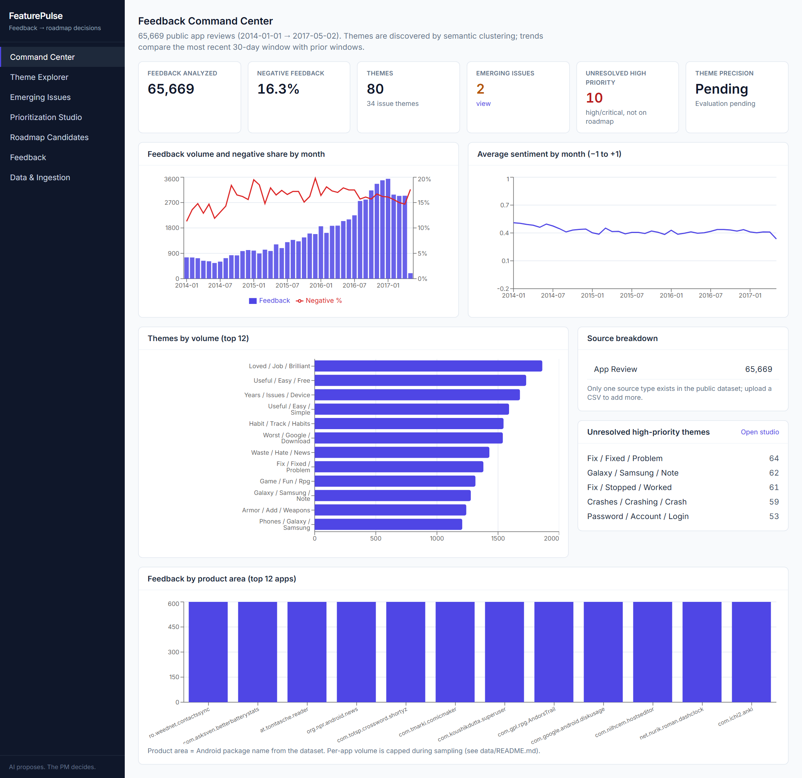
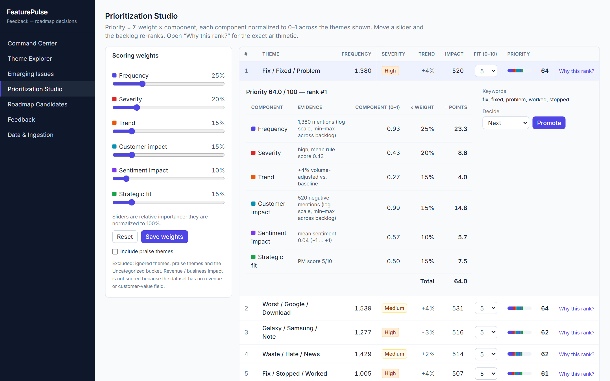
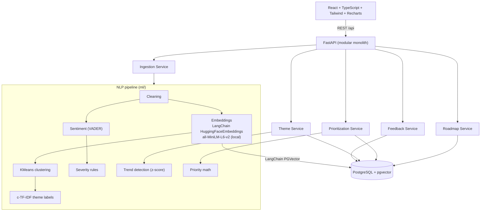

# FeaturePulse

**Turn fragmented customer feedback into evidence-backed product decisions.**

FeaturePulse is a feedback-to-roadmap decision engine for product managers. It ingests customer feedback, groups reports of the same underlying problem into semantic themes (even when worded differently), quantifies them, ranks them with a transparent scoring model, and lets the PM turn themes into roadmap decisions. Everything runs locally: no paid APIs and no API keys.



## What it does

The product question: *how can a PM turn thousands of fragmented pieces of feedback into defensible roadmap decisions?*

"App freezes when I upload photos", "Uploading an image crashes everything" and "Can't attach pictures" land in the same theme, so a PM sees one issue with its real volume instead of hundreds of separate comments.

```
Feedback → Embeddings → Semantic Themes → Trends → Priority Engine → PM Decision → Roadmap
```

| Page | Purpose |
|---|---|
| **Command Center** | Feedback volume, negative share, theme count, emerging issues, unresolved high-priority themes, sentiment trend, source and product-area breakdowns |
| **Theme Explorer** | Browse semantic themes with volume, trend, severity and keywords; filter by sentiment, severity, source, segment, product area and date; rename, merge, ignore and promote themes |
| **Emerging Issues** | Trend detection: recent window vs. baseline windows, adjusted for overall volume growth, with absolute/percentage change and z-score |
| **Prioritization Studio** | Adjustable weighted score (frequency, severity, trend, customer impact, sentiment, strategic fit); sliders re-rank the backlog; “Why this rank?” shows every point of the score |
| **Roadmap Candidates** | Now / Next / Later / Investigate / Won't Do with rationale, notes, status and evidence links |
| **Feedback** | Every record with its theme, sentiment, severity and similar feedback; keyword and semantic search; per-record theme correction |
| **Data & Ingestion** | CSV upload with column mapping, validation and ingestion statistics |



### Decision support, not a black box

Every automatic output can be overridden by the PM and the override persists: theme names, theme merges, severity, strategic fit, scoring weights, ignored themes, and individual feedback assignments. Each correction is stored in a `theme_corrections` table (feedback, old theme, new theme, timestamp) as labeled data for future model improvement. The score is a plain weighted sum whose contributions are shown component by component.

## How it works

1. **Ingest:** a seeded public app-review dataset (288,065 raw reviews → 65,669 analyzed after cleaning and per-app sampling) or a user CSV.
2. **Clean:** strip URLs/e-mails, drop uninformative and non-English text, consolidate exact duplicates.
3. **Embed:** `all-MiniLM-L6-v2` sentence embeddings, computed locally.
4. **Cluster:** KMeans (k = 80), chosen after comparing KMeans, DBSCAN and HDBSCAN (the density methods left over 92% of reviews unassigned). Results in `reports/clustering_evaluation.json`.
5. **Label:** class-based TF-IDF keywords and representative quotes; no LLM required.
6. **Score:** sentiment (VADER blended with the star rating), rule-based severity, volume-adjusted trend.
7. **Prioritize:** `Priority = 100 × Σ wᵢ·cᵢ` over six normalized components with PM-controlled weights. Revenue impact is intentionally not modeled because the data has none.
8. **Decide:** promote themes to roadmap buckets with a written rationale.

## Architecture



A single deployable service (no microservices). `backend/app/services/*` holds the product logic; `ml/*` is pure NLP and scoring code with no web or database dependencies. LangChain provides the embeddings interface, the `PGVector` store and the retriever behind semantic search and "similar feedback".

## Tech stack

| Layer | Technology |
|---|---|
| Frontend | React 18, TypeScript, Vite, Tailwind CSS, Recharts, React Router |
| API | Python 3.11, FastAPI, Pydantic, Uvicorn |
| Persistence | PostgreSQL + **pgvector**, SQLAlchemy 2 (psycopg 3) |
| Orchestration | LangChain (`langchain-huggingface` embeddings, `langchain-postgres` PGVector store and retriever) |
| Embeddings | sentence-transformers `all-MiniLM-L6-v2` (local, CPU) |
| NLP / ML | scikit-learn (KMeans, DBSCAN, HDBSCAN, PCA, TF-IDF), VADER, pandas, NumPy |
| Testing | pytest, FastAPI TestClient, throwaway PostgreSQL + pgvector instance |
| Tooling | Playwright (screenshots), Docker Compose (optional database) |

## Project structure

```
featurepulse/
├── frontend/   React + TypeScript UI (dashboard, themes, emerging, prioritization, roadmap, feedback, upload)
├── backend/    FastAPI app: routes, SQLAlchemy models, product services (feedback, themes, priorities, roadmap, ingestion, vectors)
├── ml/         preprocessing, embeddings, clustering, theming, sentiment, severity, trends, priority math
├── scripts/    data preparation, pipeline load, clustering/sentiment evaluation, labeling workflow, screenshots
├── data/       dataset notes and evaluation workflow (raw data is downloaded, not committed)
├── reports/    machine-generated evaluation and pipeline metrics (JSON)
├── tests/      pytest suite (preprocessing, embeddings, clustering, priority, trends, API, ingestion, evaluation)
├── docs/       product case study
└── screenshots/
```

## Data

Public app reviews from the `sealuzh/app_reviews` dataset (Hugging Face; 2014–2017; license listed as unknown, so it is downloaded by script rather than redistributed). Fields not present in the data, such as customer segment and revenue, are left empty rather than invented. See [`data/README.md`](data/README.md) for source, cleaning counts and limitations, and [`docs/product-case-study.md`](docs/product-case-study.md) for the product thinking behind the design.

## License

MIT (source code only).
