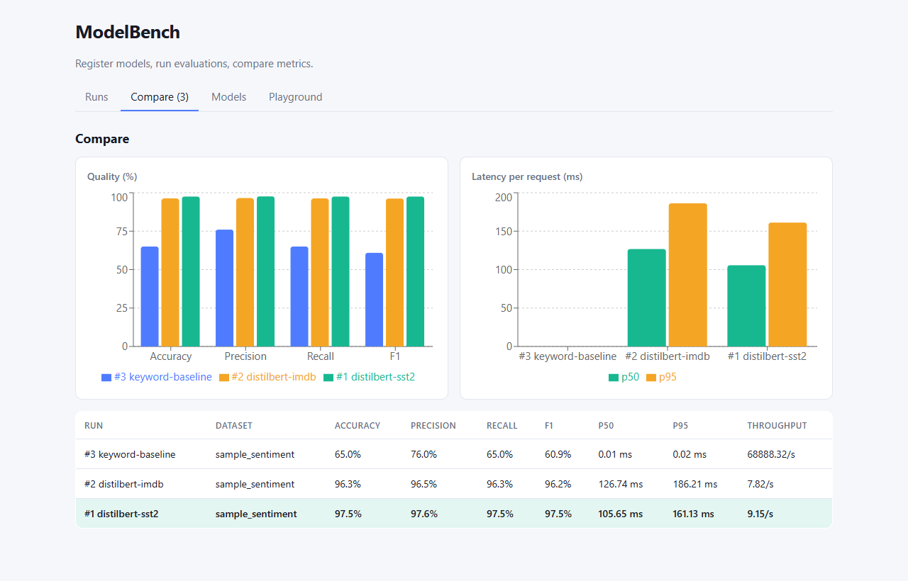
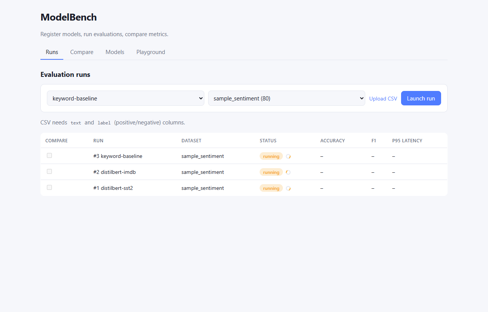
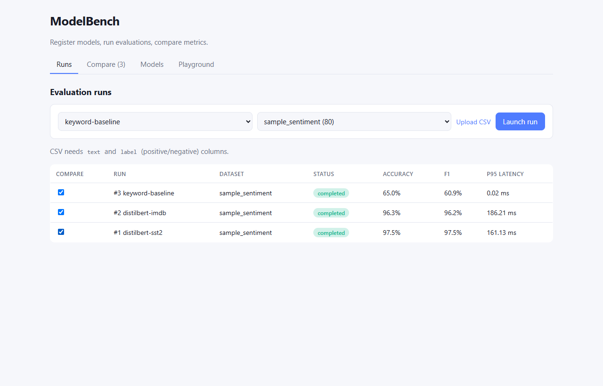
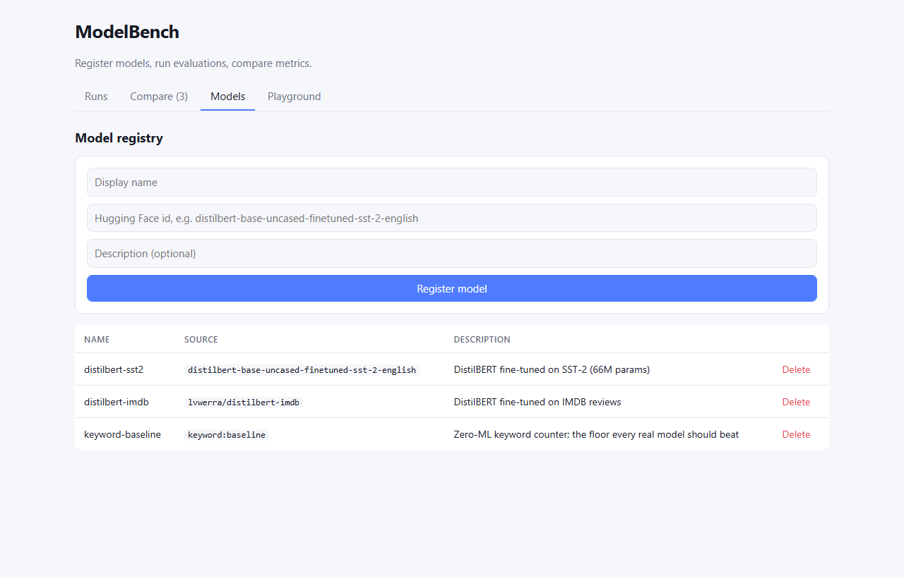
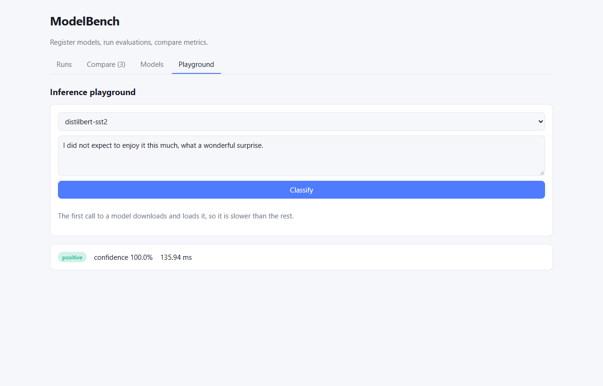

# ModelBench

ML evaluation and inference platform. ModelBench is an internal developer console for registering models, launching evaluation runs and comparing their metrics, backed by an inference endpoint with latency monitoring.

**Stack:** React, TypeScript, FastAPI, PyTorch, Hugging Face Transformers, SQLite, Docker, Prometheus, Grafana, GitHub Actions



## Highlights

- **Model comparison in minutes.** Registering models, launching evaluation runs and comparing metrics used to be a manual process. In ModelBench it takes a few clicks and a couple of minutes: three models are evaluated and charted side by side in one session.
- **Low-latency inference.** Hugging Face models are served from a Dockerized FastAPI endpoint. On a CPU-only laptop, end-to-end p95 latency is about 150 ms (p50 about 114 ms), tracked live in Grafana through a Prometheus histogram.
- **Tested and automated.** 98% backend and 96% frontend test coverage, with CI gates at 85%. GitHub Actions runs pytest and Jest, builds the Docker images and deploys on every green push to `main`.

## Screenshots

| Evaluation runs | Run results |
|---|---|
|  |  |

| Model registry | Inference playground |
|---|---|
|  |  |

## Features

- **Model registry:** register any Hugging Face text-classification model by id.
- **Evaluation runs:** run a model against a labelled dataset, either the bundled sentiment set or an uploaded `text,label` CSV. Runs execute in the background and the UI updates as they progress. Each run records accuracy, macro precision, recall and F1, a confusion matrix, p50 and p95 latency, and throughput.
- **Comparison dashboard:** select any completed runs to see grouped quality and latency charts and a table with the best F1 highlighted.
- **Inference endpoint:** single-request prediction with per-call latency, exported as Prometheus metrics.
- **Failure handling:** runs that cannot load a model are stored as failed with the error shown in the UI.

## Architecture

```
React + TypeScript (Vite, Recharts)
          |  REST /api
          v
FastAPI service ---------> SQLite (models, runs)
   |        |
   |        +-------------> PyTorch / Hugging Face pipelines (CPU, cached per model)
   |
   +-- /metrics --> Prometheus --> Grafana
```

Design decisions:

- Evaluations run one at a time. Concurrent runs compete for CPU and distort each other's latency, so a lock serializes them.
- Latency is measured per request after a warm-up call, so model load time is excluded and the numbers reflect what an endpoint actually serves.
- Models are loaded lazily and cached, and loading is guarded against concurrent first use.
- The test suite runs without downloading models, using a lightweight baseline backend and a stubbed Transformers pipeline to cover the same code paths.

## Project structure

```
backend/
  app/
    api.py            REST routes
    evaluator.py      background evaluation and latency measurement
    predictors.py     model loading and inference
    metrics.py        accuracy, precision, recall, F1, percentiles
    datasets.py       dataset loading and CSV upload
    observability.py  Prometheus instrumentation
    models.py, db.py  SQLAlchemy models and session handling
  tests/              pytest suite
  Dockerfile
frontend/
  src/
    components/       Runs, Compare, Models and Playground panels
    api.ts, utils.ts  typed API client and chart helpers
    __tests__/        Jest and Testing Library tests
  Dockerfile          multi-stage build served by nginx
monitoring/           Prometheus config and provisioned Grafana dashboard
scripts/              latency benchmark and screenshot capture
.github/workflows/    CI and deployment pipelines
docker-compose.yml    full stack: API, UI, Prometheus, Grafana
```

## CI/CD and deployment

- **CI:** backend tests with an 85% coverage gate, frontend type-check, build and Jest tests with coverage thresholds, Docker image builds and a container smoke test.
- **Deployment:** the backend image deploys to a Hugging Face Space and the frontend to GitHub Pages, both on free tiers, triggered after CI passes on `main`.

## API

| Method | Path | Description |
|---|---|---|
| GET, POST | `/api/models` | List or register models |
| DELETE | `/api/models/{id}` | Remove a model |
| GET, POST | `/api/datasets` | List datasets or upload a CSV |
| POST | `/api/runs` | Launch an evaluation run |
| GET | `/api/runs`, `/api/runs/{id}` | Run status and metrics |
| GET | `/api/compare?run_ids=1&run_ids=2` | Completed runs for comparison |
| POST | `/api/predict` | Single prediction with latency |
| GET | `/health`, `/metrics` | Liveness and Prometheus metrics |

Interactive API documentation is served at `/docs`.

## License

MIT
