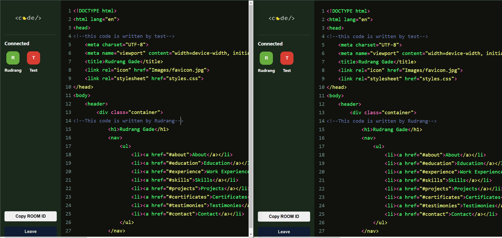
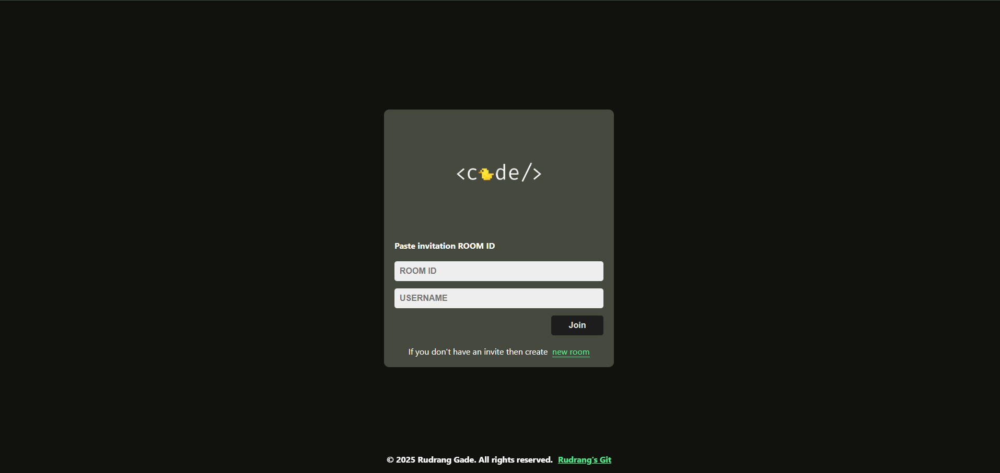

# Realtime Collaborative Code Editor

## Problem Statement
In a rapidly evolving digital workspace, remote collaboration is essential. Developers often need to work together on code in real-time, whether for pair programming, technical interviews, or brainstorming sessions. Existing solutions may lack seamless synchronization, efficient communication, or real-time editing capabilities.

This project aims to solve this challenge by developing a **real-time collaborative code editor**, enabling multiple users to edit code simultaneously with synchronized updates and built-in communication features.

---

## Aims and Objectives
The objective of this project is to build an intuitive and efficient real-time collaborative code editor with the following key features:

1. **Real-time Editing**: Multiple users can edit code simultaneously with live updates.
2. **Syntax Highlighting**: Support for multiple programming languages for better readability.
3. **Built-in Chat System**: Users can communicate directly within the editor.
4. **Session Persistence**: Users can leave and rejoin sessions without losing progress.
5. **Secure Authentication**: Ensuring only authorized users can access private sessions.
6. **Dark & Light Mode**: Customizable themes to enhance user experience.
7. **Scalability**: Ability to support multiple concurrent users efficiently.

---

## Solution Approach
This project follows a **modular development approach** using modern web technologies. The following methodologies and tools are implemented:

### **Technology Stack**
- **Frontend**: React.js, Tailwind CSS
- **Backend**: Node.js, Express.js
- **Database**: MongoDB 
- **Real-time Communication**: WebSockets (Socket.io)

### **Implementation Details**
- **Real-time Editing**: WebSocket-based synchronization ensures live updates across all connected users.
- **User Authentication**: Secure login and session management prevent unauthorized access.
- **Code Execution**: Embedded code execution allows users to test scripts within the editor.
- **Scalability Considerations**: Optimized database queries and efficient WebSocket handling improve performance.

---

This project provides a streamlined and interactive coding experience, making real-time collaboration effortless and efficient.
