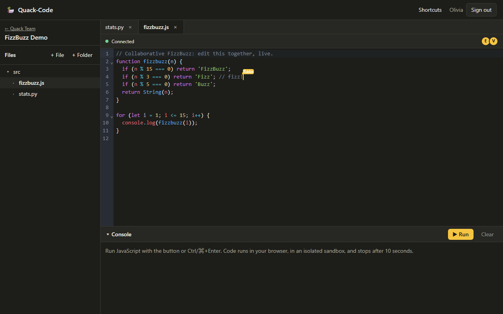
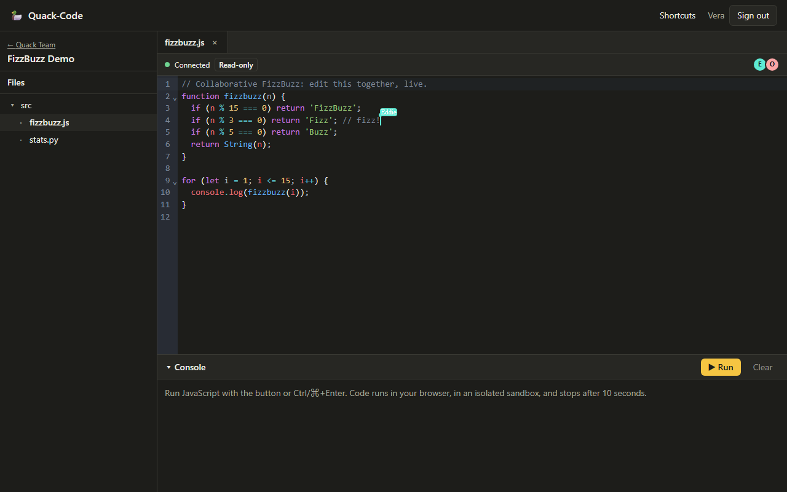
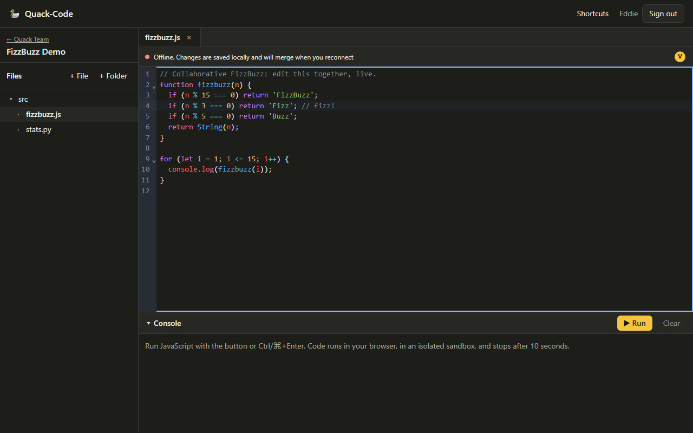
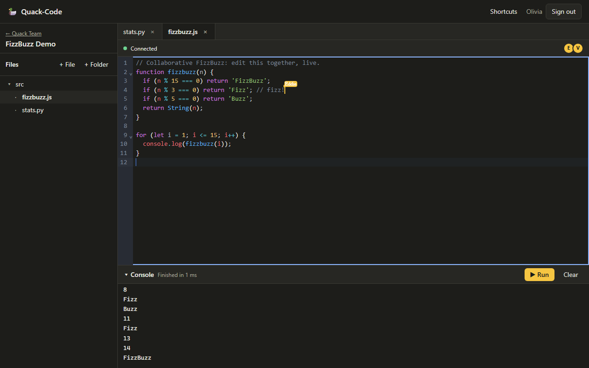
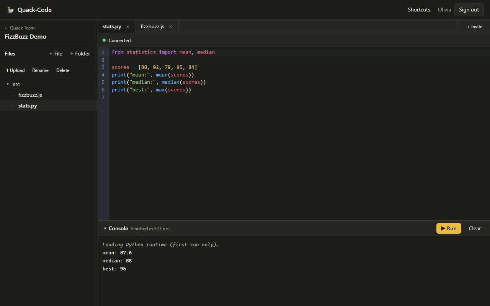
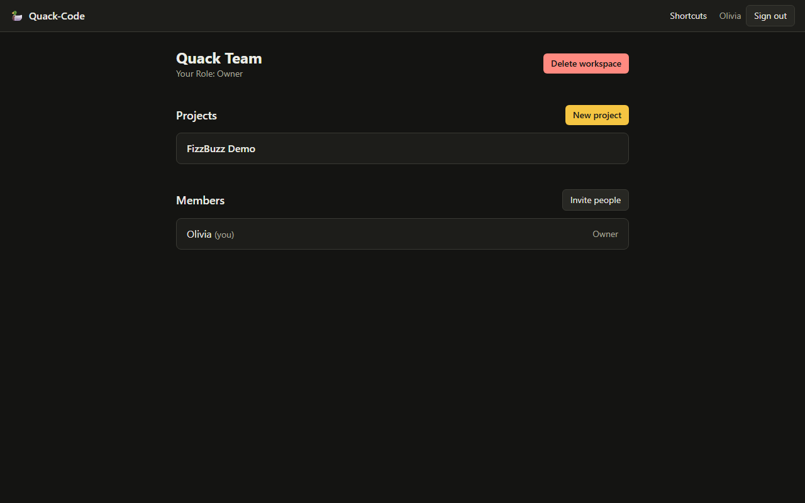
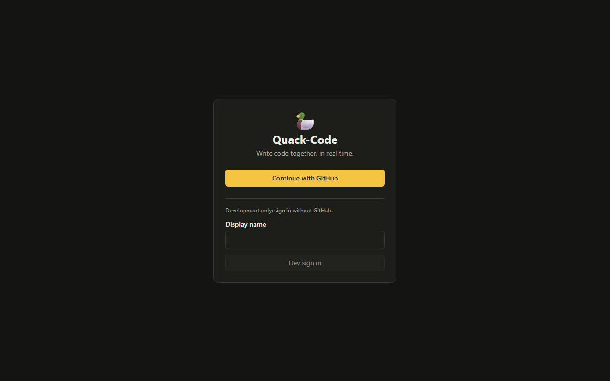
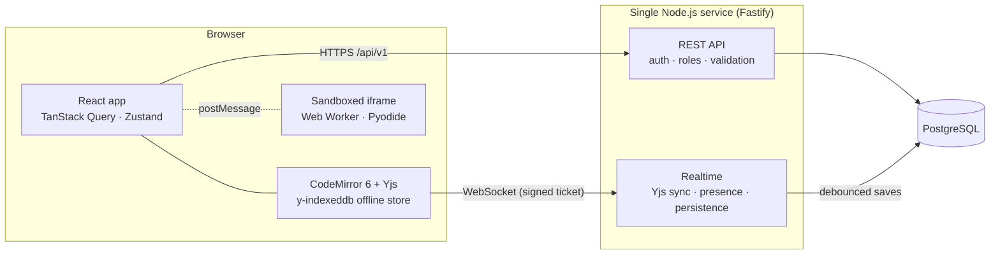

# 🦆 Quack-Code

A real-time collaborative coding workspace. Sign in, create a workspace, invite teammates with a role, and edit code together live. Run JavaScript and Python right in the browser, in an isolated sandbox.

Everything runs on free tiers or locally. No credit card is needed anywhere.



## What works today

| Area | Status |
| --- | --- |
| Accounts | GitHub OAuth (state-checked), httpOnly session cookies, a dev-login for local work |
| Workspaces | Create, rename, delete. Owner / Editor / Viewer roles, enforced on the server for every REST call and WebSocket |
| Invites | Links with a role, an expiry and a usage limit. Only a hash of the token is stored; acceptance is atomic |
| Projects & files | Multi-file projects, folders, tabs. Create, upload existing text files, rename / move and delete from a toolbar or a right-click menu (folders carry their contents). Invite teammates from the editor window |
| Real-time editing | Yjs CRDT + CodeMirror 6, live named cursors, presence avatars, per-user undo that never reverts a collaborator |
| Offline | Edits are kept in IndexedDB and merge automatically on reconnect; the status bar shows connected / reconnecting / offline |
| Running code | JavaScript in a Web Worker, Python via Pyodide, inside a sandboxed iframe with a timeout and output limits |
| Quality | 58 unit and API tests (API tests run against real Postgres), 7 Playwright end-to-end tests (two-user collaboration, offline merge, file management, sandbox, axe accessibility), CI |

**Planned, not built yet:** line comments, version history with diff and restore, ZIP export as a background job, project search, activity feed, notifications, feature flags, Google sign-in. The design for these is in the project scope; the data model has room for them.

## Screenshots

| Roles: viewers are read-only (enforced server-side) | Offline: edits are saved locally and merge later |
| --- | --- |
|  |  |

| Run JavaScript | Run Python (Pyodide) |
| --- | --- |
|  |  |

| Workspace: members, roles, invites | Sign in |
| --- | --- |
|  |  |

## Architecture


```mermaid
flowchart LR
  subgraph Browser
    UI[React app<br/>TanStack Query · Zustand]
    ED[CodeMirror 6 + Yjs<br/>y-indexeddb offline store]
    SB[Sandboxed iframe<br/>Web Worker · Pyodide]
    UI --- ED
    UI -. postMessage .- SB
  end
  subgraph Node["Single Node.js service (Fastify)"]
    API[REST API<br/>auth · roles · validation]
    RT[Realtime<br/>Yjs sync · presence · persistence]
  end
  DB[(PostgreSQL)]
  UI -- "HTTPS /api/v1" --> API
  ED -- "WebSocket (signed ticket)" --> RT
  API --> DB
  RT -- "debounced saves" --> DB
```

- **One deployable service, modules kept separate.** Free hosts do not offer background workers, so the API and the real-time layer share a process. They are separate modules, so splitting them later only changes deployment.
- **The server keeps no essential state in memory.** Documents are saved to Postgres on a debounce and when the last client leaves, so a restart loses nothing.
- **Code never runs on the server.** Execution is entirely in the browser.
- **File contents never travel over REST.** They flow only through Yjs.

### How the sandbox works

Each language runs in `<iframe sandbox="allow-scripts">` (no `allow-same-origin`), so it has an opaque origin and no access to the app's cookies, storage or DOM. The code runs in a Web Worker inside it; the app and sandbox talk only through `postMessage`. A timeout terminates the worker, output is capped, and the JavaScript sandbox has a CSP that blocks all network access. The Python sandbox may reach only the pinned Pyodide CDN. The sandbox pages are static files (generated by `apps/web/scripts/build-sandbox.mjs`) so they carry their own CSP, separate from the app's.

## Run it locally

You need Node.js 20 or newer. **No Docker and no database install**: local development uses a real PostgreSQL started from the `embedded-postgres` package.

```bash
npm install
npm run dev          # API on http://localhost:4000 (first start takes ~20s to create the database)
npm run dev:web      # app on http://localhost:5173, in a second terminal
```

Open http://localhost:5173 and use **Dev sign in** (shown only in development). To sign in with GitHub instead, create a free OAuth app at github.com/settings/developers with the callback `http://localhost:4000/api/v1/auth/github/callback`, then copy `apps/server/.env.example` to `apps/server/.env` and fill in the client id and secret.

## Tests

```bash
npm run lint
npm run typecheck
npm test                                   # unit + API integration tests (real Postgres, no setup)
npx playwright install chromium            # once
npm run test:e2e -w @quack/web             # end-to-end: two browsers, offline, sandbox, accessibility
npm run screenshots -w @quack/web          # regenerates docs/screenshots
```

## Repository layout

```
apps/server     Fastify API, WebSocket sync, Drizzle schema + migrations, integration tests
apps/web        React app, sandbox runtime, Playwright tests
packages/shared Zod schemas, roles and permission rules used by both sides
docs/decisions  Short write-ups of the main design decisions
```

## Decisions and limits

Design decisions are in [`docs/decisions`](docs/decisions). Known limitations:

- **Not deployed yet.** The code is ready for Netlify + Render + Neon (all free), but nothing is hosted. A free Render service sleeps when idle; the app shows a "waking up the server" screen for that.
- **Single instance.** Live documents and presence are held in one process's memory (persisted to Postgres). Running two instances needs a pub/sub layer such as Redis.
- **Soft document size cap.** Documents over 500,000 characters stop accepting further edits, but the edit that crosses the line is still accepted.
- **JavaScript runs one file at a time.** There is no module import across project files yet.
- **Pyodide loads from jsDelivr** on first Python run (about 8 seconds), so Python needs internet access.
