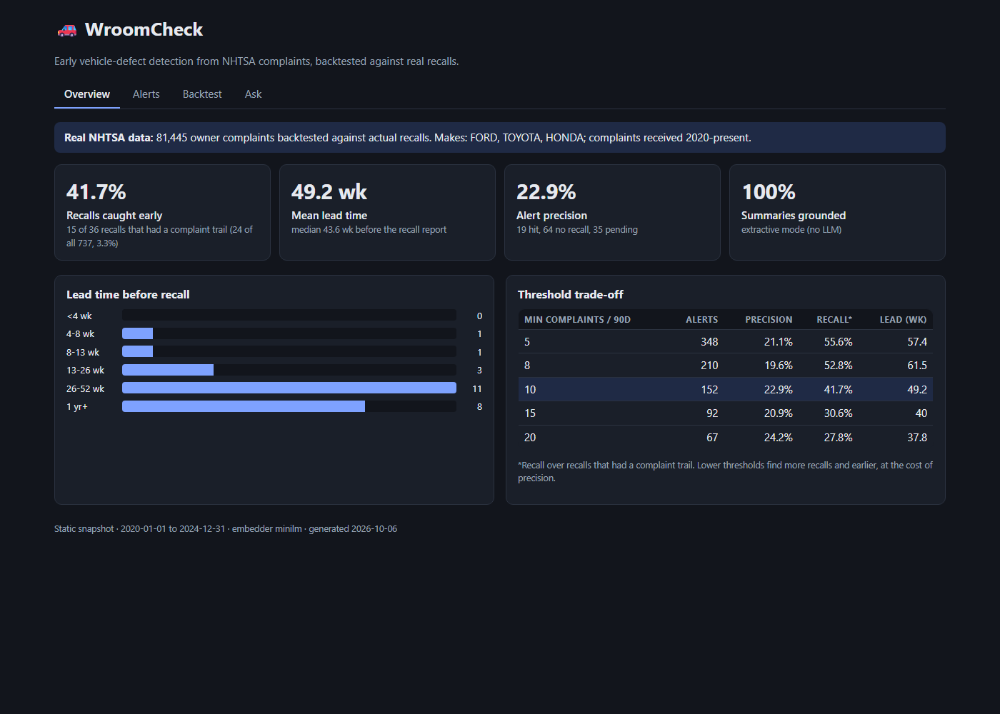
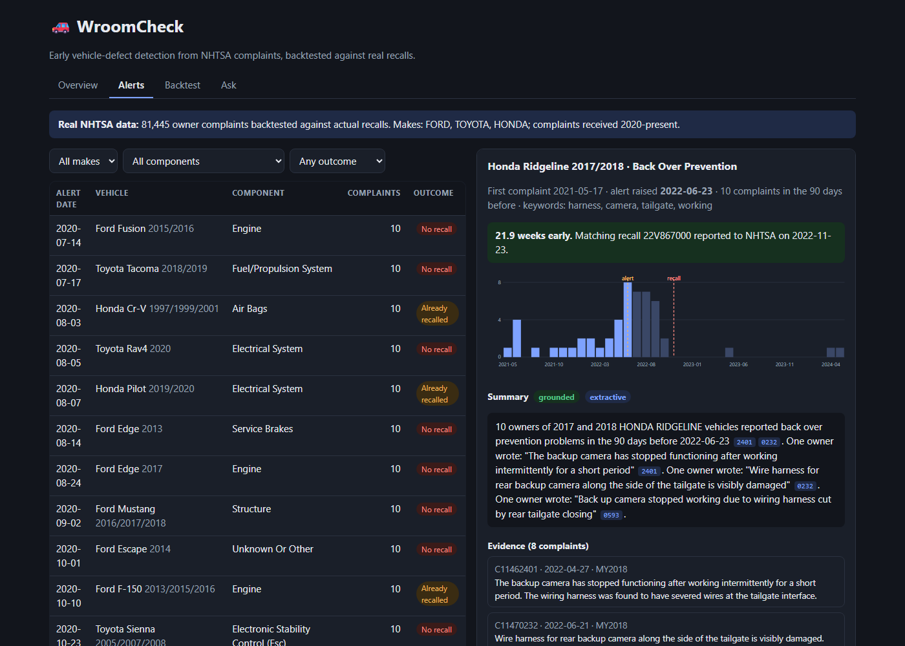
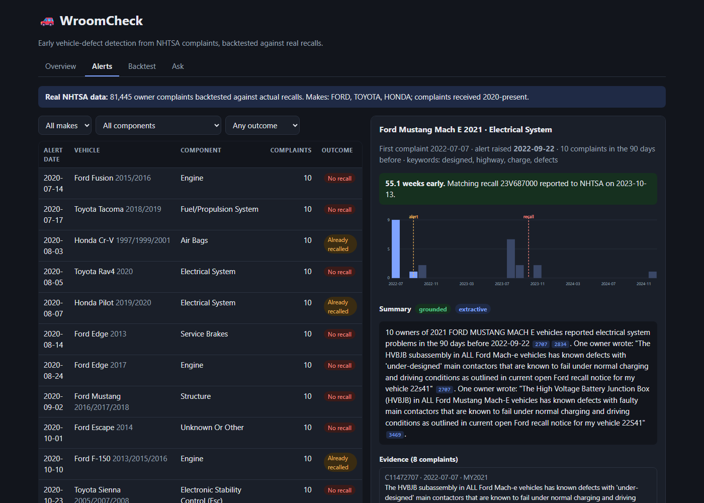

# WroomCheck

A project that looks at car owner complaints and tries to spot a vehicle defect before the manufacturer officially recalls it.

I built it to find out one thing: when a car has a real problem, do owners start complaining months before the recall? If they do, a system watching those complaints could warn people earlier.



## Why I built this

Recalls are announced after the manufacturer files a report with NHTSA (the US vehicle safety agency). By then, owners may have been dealing with the problem for months. NHTSA publishes every complaint owners send in, so the early signal might already be sitting in public data. I wanted to test that idea on real data instead of just assuming it.

I also wanted a project that touches the whole stack: messy real data, embeddings, clustering, an LLM and RAG, an API, and a frontend.

## The data

Everything comes from NHTSA's public downloads (nhtsa.gov/nhtsa-datasets-and-apis). I used two datasets:

- **Complaints.** Owners describe what went wrong in their own words (for example "the brake pedal went to the floor"). Each one has the make, model, model year, the component that failed, the date NHTSA received it, and flags for crash, fire and injury.
- **Recalls.** Every recall campaign with the make, model, years, component, a description of the defect, and the date the manufacturer filed its report.

The idea is simple. Take the complaints, pretend it is a past date, and ask whether my system would have raised an alarm. Then check the recall data to see whether a recall really came later, and how many weeks after my alarm.

The raw files are too big for GitHub, so they are not in this repo. The download command fetches them.

## What the project does

1. **Cleans the complaints.** The raw data needed more cleaning than I expected (see "Problems I ran into").
2. **Turns each complaint into numbers.** I use a small free language model (MiniLM) that converts text into a vector, so complaints that describe the same problem in different words end up close together.
3. **Groups similar complaints.** For each make, model and component, complaints are processed in date order. A new complaint joins the closest existing group, or starts a new group if nothing is close enough. It only looks at complaints that came before it, so there is no cheating with future information.
4. **Raises an alert when a group spikes.** A group triggers an alert when it gets 10 or more complaints in 90 days and is growing faster than its own history. If two or more of the complaints mention a crash, fire or injury, 5 is enough.
5. **Summarises the alert with sources.** Each alert gets a short summary where every sentence points to the complaints it came from.
6. **Backtests against real recalls.** An alert counts as matching a recall if the make, model, component and model year agree and the text is similar to the recall description. Lead time is the recall date minus the alert date.
7. **Shows it all in a dashboard** with a FastAPI backend and a React and TypeScript frontend.

## Architecture

```
NHTSA files (complaints + recalls)
        |
        v
  parse and clean  --->  embeddings (MiniLM)  --->  pgvector (Postgres)
        |                                                 |
        v                                                 v
  cluster by make/model/component                   RAG question answering
        |
        v
  spike detection  --->  alerts
        |                  |
        |                  +--->  LLM summary with citations + grounding check
        v
  backtest against recalls  --->  metrics
        |
        v
  FastAPI  --->  React dashboard
```

The code is in `src/wroomcheck/`:

| File | What it does |
| --- | --- |
| `nhtsa.py` | download and parse the NHTSA files, cleaning |
| `embeddings.py` | MiniLM embeddings, plus a simple word-hash embedder for tests |
| `detect.py` | clustering and spike detection |
| `backtest.py` | matches alerts to recalls, computes lead time and precision |
| `summarize.py`, `grounding.py` | cited summaries and the check that they are faithful |
| `rag.py`, `db.py`, `schema.sql` | pgvector storage and question answering |
| `api.py` | FastAPI endpoints |
| `synth.py` | fake data generator used for tests and a quick demo |

## API

| Endpoint | What it returns |
| --- | --- |
| `GET /api/meta` and `/api/metrics` | dataset info and the backtest numbers |
| `GET /api/alerts` | alerts, filter by make, model, component or outcome |
| `GET /api/alerts/{id}` | one alert with its timeline, summary and evidence complaints |
| `GET /api/campaigns` | every recall and whether it was caught early, late or missed |
| `POST /api/ask` | ask a question, get an answer built from retrieved complaints |

Interactive docs are at `/docs` when the server is running.

## The LLM and RAG part

- **Summaries.** `summarize.py` has a LangChain chain (prompt, then a local Ollama model, then an output parser). The prompt tells the model to cite every sentence like `[C12345]` and use only the complaints it is given. Afterwards `grounding.py` checks each sentence: it must cite complaints from the alert's evidence, and any number it states must appear in those complaints. If the LLM fails the check twice, the code falls back to a plain extractive summary that quotes the complaints directly.
- **RAG.** `POST /api/ask` embeds your question, pulls the closest complaints from pgvector, and has the LLM answer using only those, with citations.
- **What I have and have not run.** The screenshots in this README use the extractive summaries. The Ollama LLM path and the pgvector and RAG path are written, but I have not run them end to end yet because I did not have Docker or Ollama set up. I would rather say that than pretend.

I used free local tools on purpose (MiniLM and Ollama), so the whole project costs nothing to run.

## Results

I ran it on Ford, Toyota and Honda complaints received from 2020 to 2024. That is 81,445 complaints checked against 737 real recall campaigns (one per make and model).

| Measure | Result |
| --- | --- |
| Recalls caught before the recall report, among recalls that had a complaint trail | 41.7% (15 of 36) |
| Same measure over all 737 recalls | 3.3% |
| Lead time, median and mean | 44 and 49 weeks |
| Precision (alerts followed by a matching recall within 18 months) | 22.9% |

The second row is low because most recalls never show up in owner complaints. A manufacturer often finds the problem itself, so there is nothing for this kind of system to detect. That is why I report the first row separately, using recalls that had at least 12 matching complaints in the 180 days before.

Some alerts that matched real recalls, where I read the complaints and the recall text side by side:

| Vehicle | What owners reported | Alert came |
| --- | --- | --- |
| Honda Ridgeline | rear camera dying, tailgate wiring harness severed | 22 weeks early |
| Ford Fusion | front brake line failing, pedal to the floor | 26 weeks early |
| Ford Mustang Mach-E | high voltage battery contactor failures | 55 weeks early |
| Honda Civic, CR-V, HR-V | steering feeling sticky or jerky at highway speed | 39 to 91 weeks early |



Each alert page shows the monthly complaint count, the alert date, the recall date, a summary where the little chips are citations, and the complaints behind it.



The Backtest tab lists every recall and whether it was caught early, late or missed ([screenshot](docs/screenshots/backtest.png)).

### What is not good yet

- Precision is only about 23%. Three out of four alerts did not have a matching recall within 18 months. Some of them may be real problems that were never recalled, but I cannot tell from this data.
- A few of the early detections are probably luck. A big cluster can match a recall on make, model and component without really being the same defect. One alert can also get credit for several later recalls about the same issue, which makes the average lead time look bigger than it is.
- It is only three makes and five years, and I have not tuned the settings on one time period and tested on another yet.

## Problems I ran into

The first version only ran on fake data I generated, and it looked great. Running it on real data was humbling and taught me the most.

- My first recall download link was wrong (404). NHTSA splits the recall files into before and after 2010, and the file I guessed does not exist.
- NHTSA repeats a complaint once for every component it lists, so the same text was being counted two or three times. I now keep one row per complaint number.
- A lot of complaints are owners writing about a recall repair ("I got notice of campaign 22V142000 but the part isn't available"). Those react to a recall, so they leak the answer into the backtest. I drop any complaint that mentions a campaign number.
- Complaints are full of templated phrases like "The contact owns a 2016 Ford Fusion. The contact stated...". With simple word matching these made giant clusters of unrelated complaints, which gave fake early detections. Stripping that text and switching to MiniLM embeddings fixed most of it. With the simple embedder the system caught 2 recalls early. With MiniLM it caught 15.
- Matching alerts to recalls by make, model and component alone was too loose, so I added a text similarity check between the alert and the recall description.

I added regression tests for the data cleaning problems.

## Run it

You need Python 3.10+ and Node 18+.

```bash
python -m venv .venv
.venv\Scripts\activate            # Mac/Linux: source .venv/bin/activate
pip install -e ".[embed,api,dev]"

wroomcheck download               # NHTSA recall and complaint files
wroomcheck real --makes FORD,TOYOTA,HONDA --year-from 2020 --embedder minilm --threshold 0.6 --out frontend/public/snapshot.json

cd frontend
npm install
npm run dev                       # open http://localhost:5173
```

Embedding 80K complaints on a CPU takes around 25 minutes. The vectors are cached in `data/work/`, so changing the settings afterwards only takes a few minutes.

**Quick demo with no downloads:** `wroomcheck demo` generates fake complaints for made-up car brands with planted defects and runs everything. It is mainly for testing, and the numbers say nothing about real performance.

**Full stack with Postgres, pgvector and RAG:**

```bash
docker compose up -d db
copy .env.example .env
pip install -e ".[all]"
wroomcheck init-db
wroomcheck ingest --year-from 2020 --makes FORD,TOYOTA,HONDA
wroomcheck embed
wroomcheck detect
wroomcheck serve                  # API at http://localhost:8000/docs
```

For the local LLM, install Ollama, run `ollama pull llama3.2:3b`, set `WROOM_LLM=ollama` in `.env`, and add `--llm ollama` to the detect command.

Run the tests with `pytest`.

## Tech stack

Python, NumPy, sentence-transformers (MiniLM), LangChain with Ollama, Postgres with pgvector, FastAPI, React, TypeScript, Vite, pytest, GitHub Actions.

## What I would do next

- Add the 2015 to 2019 complaints and more makes for a longer backtest.
- Tune settings on one period and report results on a later held-out period.
- Cut false alerts by handling big generic clusters better.
- Run the LLM summaries and measure how often the model makes things up.
- Run and test the Postgres and RAG path end to end.

## Data and license

Complaint and recall data are from NHTSA's public datasets. The code is MIT licensed.
