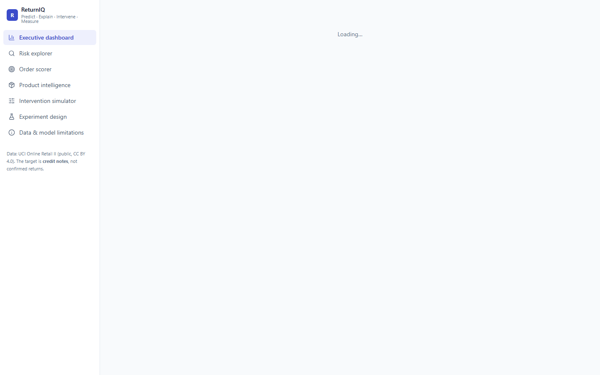
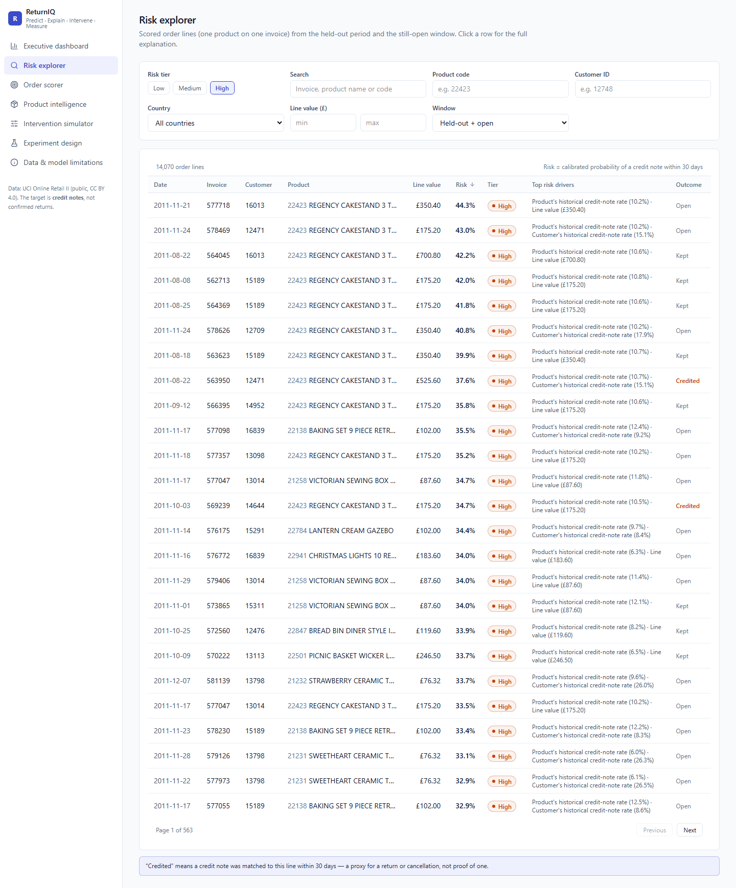
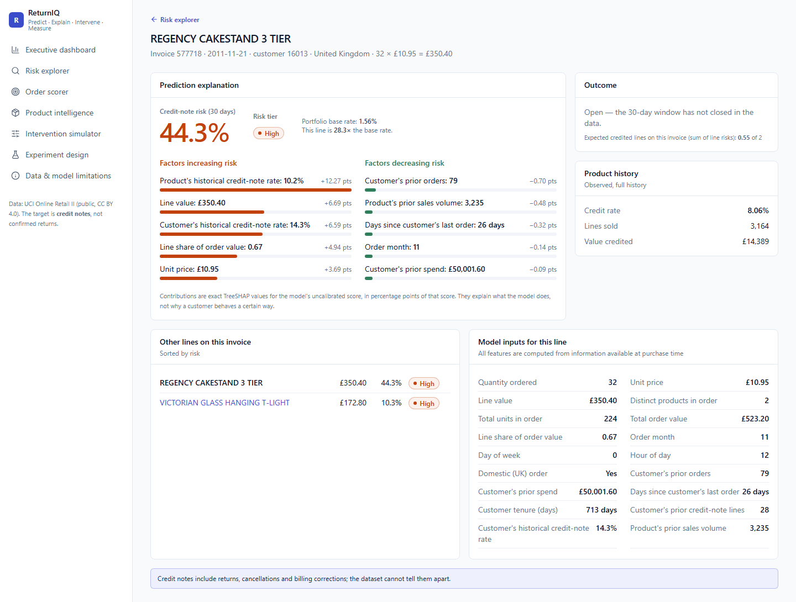
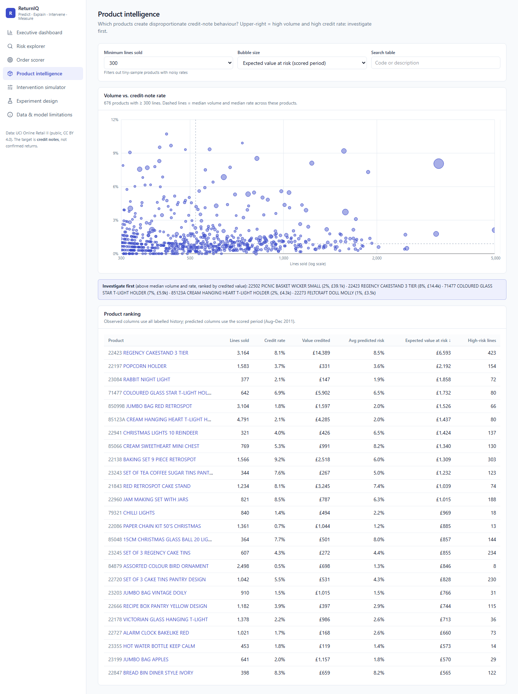
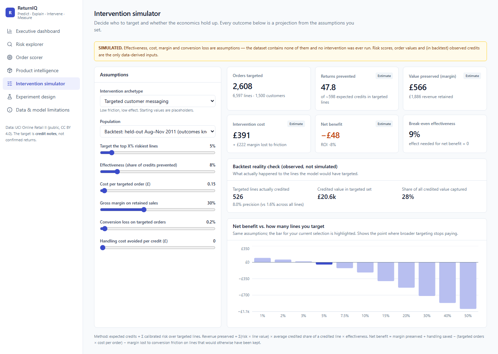
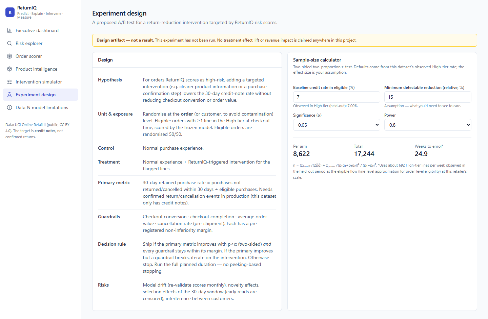
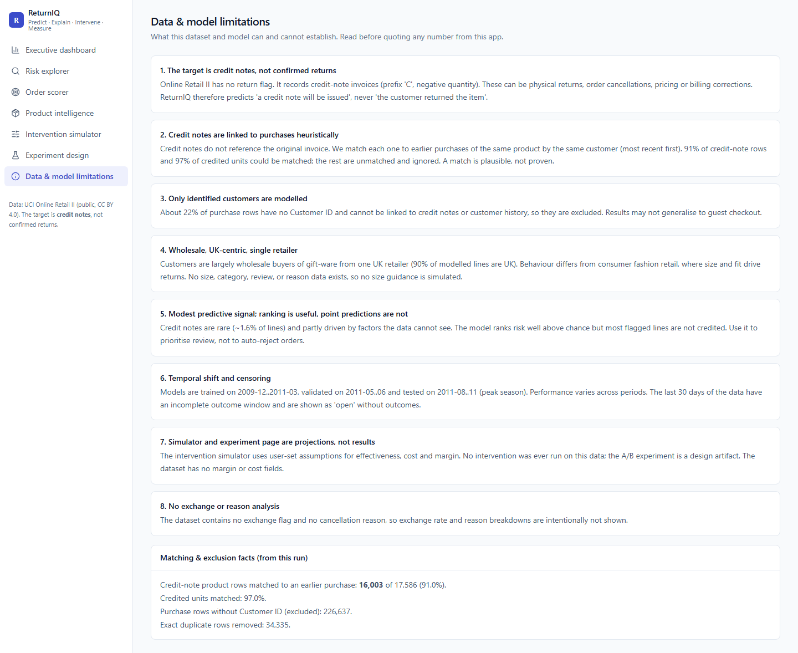
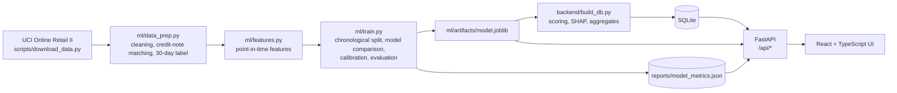

# ReturnIQ — Product Intelligence for Reducing E-Commerce Returns

**Predict → Explain → Intervene → Measure.** ReturnIQ ranks purchases by their risk of ending in a customer credit note (a return/cancellation proxy), explains every score, and lets a product manager test whether an intervention would pay for itself.

## What the project is

Returns and cancellations cost e-commerce teams money, but standard dashboards only report them after they happen. ReturnIQ is a product prototype for merchandising, product and operations teams that answers, before the 30-day window closes:

- Which orders and products are most likely to come back?
- Why does the model think so?
- Which products drive a disproportionate share of credit notes?
- Would an intervention be worth its cost, and how would we test it?

It is built on the real, public **UCI Online Retail II** dataset (about 1M transactions, 2009–2011). That dataset has no "return" flag, so the model predicts *"a credit note will be matched to this purchase within 30 days"*, a documented proxy. All metrics are computed from the data; none are hand-entered. Details: [`data/README.md`](data/README.md).

## What it does

| Page | Purpose |
|---|---|
| **Executive dashboard** | Observed credit-note rate, model quality on a held-out period, expected value at risk, risk trend, top products, segments |
| **Risk explorer** | Search and filter scored order lines by tier, product, customer, country and value |
| **Prediction explanation** | Risk %, tier, and the factors increasing or decreasing risk (exact SHAP values) |
| **Order scorer** | Score a hypothetical order through the API |
| **Product intelligence** | Volume vs. credit-note rate vs. value at risk, to show which products to investigate first |
| **Intervention simulator** | Set a risk threshold, effectiveness, cost, margin and conversion loss to see projected net benefit (clearly labelled as assumptions) |
| **Experiment design** | A/B test design with guardrails and a sample-size calculator (a design, not a result) |
| **Data & model limitations** | What the data can and cannot establish |

### Screenshots

**Executive dashboard**

**Risk explorer**

**Prediction explanation**

**Product intelligence**

**Intervention simulator**

**Experiment design**

**Data & model limitations**

## Architecture

- **`ml/`** holds the reproducible pipeline: cleaning, target construction, leak-free features, training and evaluation, SHAP inference.
- **`backend/`** is a FastAPI service over SQLite, with the intervention simulator and experiment sample-size logic as tested pure functions.
- **`frontend/`** is the React dashboard that talks to the API.
- **`tests/`, `docs/`, `reports/`, `screenshots/`** hold tests, the product case study, generated metrics and app captures.

## Tech stack

| Layer | Technology |
|---|---|
| Frontend | React, TypeScript, Vite, Tailwind CSS, Recharts |
| Backend | Python, FastAPI, Pydantic, SQLAlchemy |
| Database | SQLite (zero-cost, local) |
| Machine learning | pandas, NumPy, scikit-learn (logistic regression, random forest, gradient boosting), XGBoost, SHAP |
| Testing | pytest, Vitest |
| Tooling | Playwright (screenshots), Mermaid (diagrams) |

Everything runs locally for free: no paid APIs, databases or cloud services.

## More

[Product case study](docs/product-case-study.md) · [Data documentation](data/README.md) · [License (MIT)](LICENSE)
